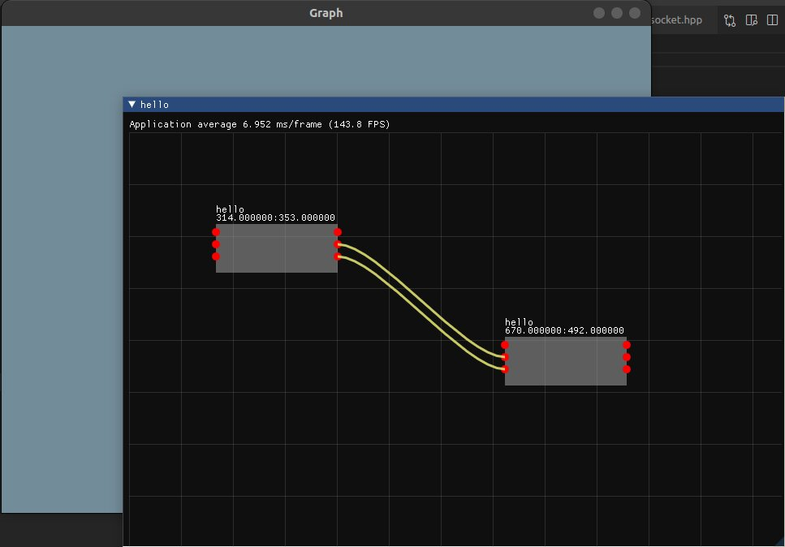

# Icarus

## Create Basic Node As
```c++
auto lambda = [](std::shared_ptr<Node> node){
    node->setSocketsNum(2,5);
    node->setNodeSize(400, 200);
    node->node_body_color = IM_COL32(200, 200, 150, 200);
};
auto node = scene->addNode(lambda);
```